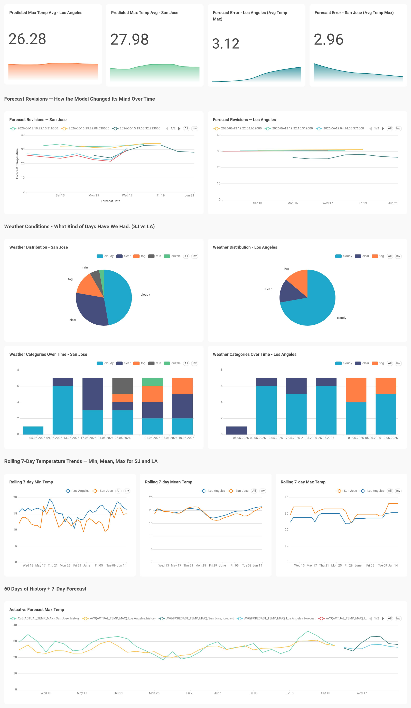

# Weather Forecasting & Analytics Dashboard

An end-to-end data engineering pipeline that ingests real weather data for San Jose and Los Angeles, trains Snowflake forecasts, transforms the output through dbt marts, and surfaces insights on a live analytics dashboard.

**Stack:** Open-Meteo API -> Apache Airflow (Docker) -> Snowflake (`SNOWFLAKE.ML.FORECAST`) -> dbt -> GitHub Actions -> Web Dashboard (Plotly.js) / Preset Cloud

**Live Dashboard:** [ishuapurva1996.github.io/weather-forecasting-dashboard](https://ishuapurva1996.github.io/weather-forecasting-dashboard/)

The pipeline ingests 60 days of historical daily weather, produces a 7-day forecast with a 95% prediction interval, transforms the result into analytics-grade marts (with dbt tests and an SCD-2 snapshot), and surfaces the output on Preset plus a public static Plotly dashboard.

---

## Dashboard Preview

[](https://ishuapurva1996.github.io/weather-forecasting-dashboard/)

---

## Architecture


Three chained Airflow DAGs plus a dbt project:

1. **`WeatherData_multiple_cities_data` (ETL DAG)** — extracts past 60 days of daily weather for San Jose and Los Angeles from Open-Meteo, transforms the JSON response into typed records, and loads `RAW.WEATHER_ETL_MULTIPLE_CITIES` inside a Snowflake transaction (BEGIN / DELETE / INSERT / COMMIT, ROLLBACK on error). Triggers DAG 2 on success.
2. **`forecast_model_temp_max` (ML DAG)** — creates a view over the raw table, trains `SNOWFLAKE.ML.FORECAST` per city series, and writes 7-day predictions with 95% PI to `ANALYTICS.WEATHER_FORECAST_LAB1`. Triggers DAG 3 on success.
3. **`weather_dbt_pipeline` (dbt DAG)** — runs `dbt seed`, `dbt snapshot`, `dbt run`, and `dbt test` sequentially via `BashOperator`, materializing the seed, staging models, marts, and snapshot tables in `ANALYTICS`. After tests pass, it can dispatch the GitHub Actions dashboard deploy workflow.

DAG chaining uses `TriggerDagRunOperator` with `wait_for_completion=False`.

## Repository layout

```
.
├── dags/                              # Airflow DAGs
│   ├── weather_ETL_model.py           # DAG 1 — ETL
│   ├── forecast_model_temp.py         # DAG 2 — ML forecast
│   └── weather_dbt_dag.py             # DAG 3 — dbt seed/snapshot/run/test runner
├── dbt/
│   ├── dbt_project.yml
│   ├── profiles.yml                   # reads DBT_* env vars from Airflow conn
│   ├── models/
│   │   ├── source.yml
│   │   ├── schema.yml                 # generic tests
│   │   ├── staging/                   # stg_weather_history, stg_weather_forecast
│   │   └── marts/                     # fct_*, dim_weather_code
│   ├── seeds/wmo_weather_codes.csv    # WMO code → category lookup
│   └── snapshots/snp_weather_forecast.sql   # SCD-2 over forecast table
├── docs/
│   ├── system_architecture.excalidraw
│   ├── system_architecture.png
│   ├── index.html
│   ├── css/
│   ├── js/
│   └── data/                          # GitHub Pages deployment copy
├── sql/
│   └── snowflake_setup.sql            # Snowflake database/schema/bootstrap grants
├── dashboard_v3_preview.png           # Dashboard preview image for README
├── web_dashboard/                     # Static Plotly dashboard + Snowflake JSON exporter
│   ├── export_data.py
│   ├── index.html
│   ├── css/dashboard.css
│   ├── js/dashboard.js
│   └── data/*.json
├── .github/workflows/
│   └── deploy-dashboard.yml           # Snowflake export -> docs/ GitHub Pages deploy
├── plugins/
├── config/
├── Dockerfile
└── docker-compose.yaml                # Airflow + dbt-snowflake stack
```

## Data model

| Layer | Object | Description |
|---|---|---|
| RAW | `weather_etl_multiple_cities` | raw daily weather (PK: latitude, longitude, date) |
| ANALYTICS | `weather_forecast_lab1` | ML forecast output (series, ts, forecast, lower/upper bound) |
| ANALYTICS | `stg_weather_history`, `stg_weather_forecast` | dbt staging views |
| ANALYTICS | `fct_daily_weather` | union of history ∪ forecast with `record_type` discriminator |
| ANALYTICS | `fct_forecast_accuracy` | yesterday's forecast vs today's actual; error, abs_error, days_ahead, in-interval flag |
| ANALYTICS | `fct_weather_rolling` | trailing 7-day min/mean/max |
| ANALYTICS | `fct_weather_category_daily` | history joined to `dim_weather_code` for human-readable categories |
| ANALYTICS | `dim_weather_code` | WMO code lookup (description, category, severity) |
| ANALYTICS | `snp_weather_forecast` | SCD-2 snapshot of `weather_forecast_lab1` (`check` strategy) |

Detailed schemas (fields, types, constraints) are documented in `docs/system_architecture.png`.

## Setup

### Prerequisites
- Docker + Docker Compose
- A Snowflake account with privileges to create databases, schemas, tables, views, and `SNOWFLAKE.ML.FORECAST` models
- A Preset Cloud workspace (for the dashboard)

### Run locally

```bash
docker compose up -d
# Airflow web UI:  http://localhost:8080
```

The included `Dockerfile` installs `dbt-snowflake==1.8.3` into `/opt/dbt_venv` and mounts the `dbt/` project into the Airflow container at `/opt/airflow/dbt`.

### Snowflake setup

In Snowflake, run `sql/snowflake_setup.sql` as `ACCOUNTADMIN` or another role with database/schema privileges. It creates:

- `WEATHER_FORECASTING`
- `RAW`
- `ANALYTICS`
- `COMPUTE_WH` if it does not already exist
- optional `DASHBOARD_RO` read-only role for Preset

### Airflow configuration

**Connection** — `snowflake_conn` (Snowflake):
- login, password
- extras (`extra_dejson`): `account`, `database`, `warehouse`, `schema`, `role`

The dbt DAG re-uses this connection by templating `DBT_*` env vars from `conn.snowflake_conn.*` into the `BashOperator` environment, which `dbt/profiles.yml` reads via `env_var(...)`.

**Variables** — city coordinates:
- `city1_LATITUDE`, `city1_LONGITUDE` — San Jose (37.34, −121.89)
- `city2_LATITUDE`, `city2_LONGITUDE` — Los Angeles (34.05, −118.24)

**Optional dashboard deploy variables** — only needed if the dbt DAG should dispatch the GitHub Pages refresh after `dbt test`:
- `GITHUB_PAT` — token with permission to dispatch Actions workflows
- `GITHUB_REPOSITORY` — owner/repo, for example `your-user/weather-forecasting-pipeline`
- `GITHUB_BRANCH` — defaults to `main`
- `DASHBOARD_WORKFLOW_FILE` — defaults to `deploy-dashboard.yml`

### dbt commands (run inside the Airflow container, or locally)

```bash
dbt deps      # if you add packages
dbt seed      # loads wmo_weather_codes
dbt snapshot
dbt run
dbt test
```

## BI dashboard

The Preset Cloud dashboard reads five marts plus the snapshot directly:

- KPI strip — predicted max temp & forecast error per city (`fct_daily_weather`, `fct_forecast_accuracy`)
- Forecast revisions — line chart per city from `snp_weather_forecast` (SCD-2 history)
- Weather conditions — pies + stacked bars from `fct_weather_category_daily`
- Rolling 7-day trends — min / mean / max from `fct_weather_rolling`
- Hero — 60 days of actuals + 7-day forecast from `fct_daily_weather`

### Public GitHub Pages dashboard

A public static dashboard lives in `web_dashboard/`, following the same shape as the EV charging stations reference project: Plotly.js charts load pre-exported JSON files, so the live page does not need Snowflake credentials in the browser.

The public dashboard includes:

- KPI strip — latest forecast, latest actual, mean absolute error, and prediction interval hit rate
- Actuals + forecast hero chart — 60-day history with the 7-day forecast and confidence band
- City comparison — San Jose vs Los Angeles latest actual and forecast max temperature
- Forecast accuracy — absolute error by `days_ahead`
- Forecast revisions — SCD-2 snapshot changes over time
- Weather conditions — category distribution and severity trend
- Rolling 7-day trends — min, mean, and max temperature

Local preview:

```bash
cd web_dashboard
python export_data.py       # requires Snowflake env vars; sample JSON is included for UI preview
python -m http.server 8000
# open http://localhost:8000
```

Required GitHub Actions secrets for live export:

- `SNOWFLAKE_ACCOUNT`
- `SNOWFLAKE_USER`
- `SNOWFLAKE_PASSWORD`
- `SNOWFLAKE_DATABASE`
- `SNOWFLAKE_WAREHOUSE`
- `SNOWFLAKE_ROLE`
- `SNOWFLAKE_SCHEMA` (optional, defaults to `ANALYTICS`)

GitHub Pages setup:

1. In GitHub, open **Settings → Pages**.
2. Set source to **Deploy from a branch**.
3. Select branch `main` and folder `/docs`.
4. Run the **Deploy Weather Dashboard** workflow manually once, or push a change under `web_dashboard/**`.

Target URL:

```text
https://ishuapurva1996.github.io/weather-forecasting-dashboard/
```

The workflow exports fresh Snowflake mart data into `web_dashboard/data/`, copies the static dashboard into `docs/`, and commits only when dashboard assets or JSON data changed. Existing architecture files under `docs/` are preserved.

Automated deployment follows the same pattern as the reference dashboard repo:

```text
Airflow dbt DAG passes
-> trigger GitHub Actions deploy-dashboard.yml
-> export Snowflake data to web_dashboard/data/
-> copy static dashboard files to docs/
-> commit and push if the exported dashboard changed
```

## Authors

Pragya Apurva · Shoury Ambarish Parab · Srija Taduri  
San Jose State University

## License / coursework note

This repo is coursework for DATA 226 (Data Warehouse and Pipelines). Snowflake account identifier and any credentials are kept out of source control and live in Airflow connections / `.env`.
