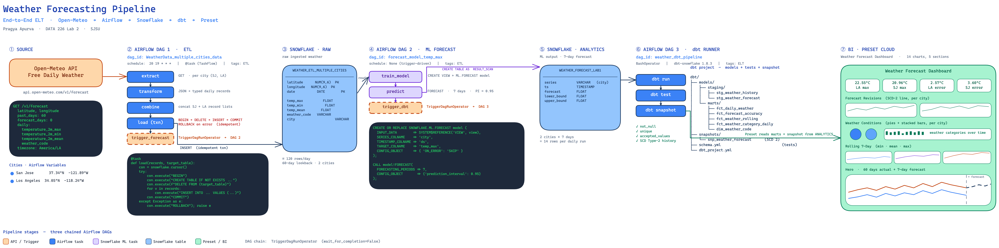

# Weather Forecasting Pipeline

End-to-end ELT pipeline for daily weather forecasting of two U.S. cities (San Jose, Los Angeles), built for **DATA 226** at SJSU.

**Stack:** Open-Meteo API → Apache Airflow → Snowflake (`SNOWFLAKE.ML.FORECAST`) → dbt → Preset Cloud.

The pipeline ingests 60 days of historical daily weather, produces a 7-day forecast with a 95% prediction interval, transforms the result into analytics-grade marts (with dbt tests and an SCD-2 snapshot), and surfaces the output on a Preset dashboard.

## Architecture



Three chained Airflow DAGs plus a dbt project:

1. **`WeatherData_multiple_cities_data` (ETL DAG)** — extracts past 60 days of daily weather for San Jose and Los Angeles from Open-Meteo, transforms the JSON response into typed records, and loads `RAW.WEATHER_ETL_MULTIPLE_CITIES` inside a Snowflake transaction (BEGIN / DELETE / INSERT / COMMIT, ROLLBACK on error). Triggers DAG 2 on success.
2. **`forecast_model_temp_max` (ML DAG)** — creates a view over the raw table, trains `SNOWFLAKE.ML.FORECAST` per city series, and writes 7-day predictions with 95% PI to `ANALYTICS.WEATHER_FORECAST_LAB1`. Triggers DAG 3 on success.
3. **`weather_dbt_pipeline` (dbt DAG)** — runs `dbt run`, `dbt test`, `dbt snapshot` sequentially via `BashOperator`, materializing staging/marts/snapshot tables in `ANALYTICS`.

DAG chaining uses `TriggerDagRunOperator` with `wait_for_completion=False`.

## Repository layout

```
.
├── dags/                              # Airflow DAGs
│   ├── weather_ETL_model.py           # DAG 1 — ETL
│   ├── forecast_model_temp.py         # DAG 2 — ML forecast
│   └── weather_dbt_dag.py             # DAG 3 — dbt runner
├── dbt/
│   ├── dbt_project.yml
│   ├── profiles.yml                   # reads DBT_* env vars from Airflow conn
│   ├── models/
│   │   ├── source.yml
│   │   ├── schema.yml                 # generic tests
│   │   ├── staging/                   # stg_weather_history, stg_weather_forecast
│   │   └── marts/                     # fct_*, dim_weather_code
│   ├── seeds/wmo_weather_codes.csv    # WMO code → category lookup
│   └── snapshots/snp_weather_forecast.sql   # SCD-2 over forecast table
├── docs/
│   ├── system_architecture.excalidraw
│   └── system_architecture.png
├── plugins/
├── config/
├── Dockerfile
└── docker-compose.yaml                # Airflow + dbt-snowflake stack
```

## Data model

| Layer | Object | Description |
|---|---|---|
| RAW | `weather_etl_multiple_cities` | raw daily weather (PK: latitude, longitude, date) |
| ANALYTICS | `weather_forecast_lab1` | ML forecast output (series, ts, forecast, lower/upper bound) |
| ANALYTICS | `stg_weather_history`, `stg_weather_forecast` | dbt staging views |
| ANALYTICS | `fct_daily_weather` | union of history ∪ forecast with `record_type` discriminator |
| ANALYTICS | `fct_forecast_accuracy` | yesterday's forecast vs today's actual; error, abs_error, days_ahead, in-interval flag |
| ANALYTICS | `fct_weather_rolling` | trailing 7-day min/mean/max |
| ANALYTICS | `fct_weather_category_daily` | history joined to `dim_weather_code` for human-readable categories |
| ANALYTICS | `dim_weather_code` | WMO code lookup (description, category, severity) |
| ANALYTICS | `snp_weather_forecast` | SCD-2 snapshot of `weather_forecast_lab1` (`check` strategy) |

Detailed schemas (fields, types, constraints) are documented in `docs/system_architecture.png`.

## Setup

### Prerequisites
- Docker + Docker Compose
- A Snowflake account with privileges to create databases, schemas, tables, views, and `SNOWFLAKE.ML.FORECAST` models
- A Preset Cloud workspace (for the dashboard)

### Run locally

```bash
docker compose up -d
# Airflow web UI:  http://localhost:8080
```

The included `Dockerfile` installs `dbt-snowflake==1.8.3` into `/opt/dbt_venv` and mounts the `dbt/` project into the Airflow container at `/opt/airflow/dbt`.

### Airflow configuration

**Connection** — `snowflake_conn` (Snowflake):
- login, password
- extras (`extra_dejson`): `account`, `database`, `warehouse`, `schema`, `role`

The dbt DAG re-uses this connection by templating `DBT_*` env vars from `conn.snowflake_conn.*` into the `BashOperator` environment, which `dbt/profiles.yml` reads via `env_var(...)`.

**Variables** — city coordinates:
- `city1_LATITUDE`, `city1_LONGITUDE` — San Jose (37.34, −121.89)
- `city2_LATITUDE`, `city2_LONGITUDE` — Los Angeles (34.05, −118.24)

### dbt commands (run inside the Airflow container, or locally)

```bash
dbt deps      # if you add packages
dbt seed      # loads wmo_weather_codes
dbt run
dbt test
dbt snapshot
```

## BI dashboard

The Preset Cloud dashboard reads five marts plus the snapshot directly:

- KPI strip — predicted max temp & forecast error per city (`fct_daily_weather`, `fct_forecast_accuracy`)
- Forecast revisions — line chart per city from `snp_weather_forecast` (SCD-2 history)
- Weather conditions — pies + stacked bars from `fct_weather_category_daily`
- Rolling 7-day trends — min / mean / max from `fct_weather_rolling`
- Hero — 60 days of actuals + 7-day forecast from `fct_daily_weather`

## Authors

Pragya Apurva · Shoury Ambarish Parab · Srija Taduri  
San Jose State University

## License / coursework note

This repo is coursework for DATA 226 (Data Warehouse and Pipelines). Snowflake account identifier and any credentials are kept out of source control and live in Airflow connections / `.env`.
