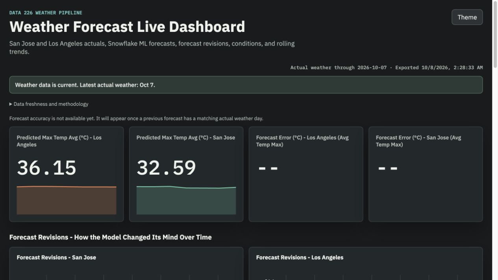
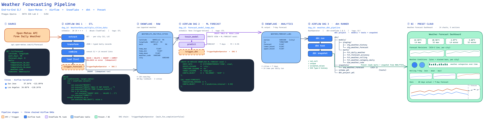

# Weather Forecasting & Analytics Dashboard

An end-to-end data engineering pipeline that ingests real weather data for San Jose and Los Angeles, trains Snowflake forecasts, transforms the output through dbt marts, and surfaces insights on a live analytics dashboard.

**Stack:** Open-Meteo API -> Apache Airflow (Docker) -> Snowflake (`SNOWFLAKE.ML.FORECAST`) -> dbt -> GitHub Actions -> Web Dashboard (Plotly.js) / Preset Cloud

**Live Dashboard:** [ishuapurva1996.github.io/weather-forecasting-dashboard](https://ishuapurva1996.github.io/weather-forecasting-dashboard/)

The weather pipeline now uses the active Snowflake account with its own `WEATHER_FORECASTING` database. Fresh ingestion, seven-day forecasting, all dbt commands/tests, and the validated private S3 export succeeded on **October 8, 2026**. The current export contains actual weather through **October 7**, with forecasts for **October 8–14**.

The [October 8, 2026 automatic refresh verification](https://github.com/ishuapurva1996/weather-forecasting-dashboard/actions/runs/37756912742) completed the full chain: fresh weather ingestion, Snowflake training/prediction, dbt build/tests, private export, Airflow dispatch, and GitHub Pages deployment. All three Airflow runs succeeded, and the canonical public JSON exactly matches the validated export.

Automatic refresh is enabled daily at **12:20 PM PDT / 11:20 AM PST** (19:20 UTC). Keep the computer and Docker running so the local Airflow scheduler can execute it. The complete chain was verified with a manually triggered run; a later scheduled occurrence has not yet been observed. Forecast accuracy remains unavailable until a prior forecast has a matching actual day. See [dashboard operations](docs/DASHBOARD_OPERATIONS.md).

The pipeline ingests 60 days of historical daily weather, produces a 7-day forecast with a 95% prediction interval, transforms the result into analytics-grade marts (with dbt tests and an SCD-2 snapshot), and surfaces the output on Preset plus a public static Plotly dashboard.

---

## Dashboard Preview

[](https://ishuapurva1996.github.io/weather-forecasting-dashboard/)

---

## Architecture



Three chained Airflow DAGs plus a dbt project:

1. **`WeatherData_multiple_cities_data` (ETL DAG)** — extracts past 60 days of daily weather for San Jose and Los Angeles from Open-Meteo, transforms the JSON response into typed records, and loads `RAW.WEATHER_ETL_MULTIPLE_CITIES` inside a Snowflake transaction (BEGIN / DELETE / INSERT / COMMIT, ROLLBACK on error). Triggers DAG 2 on success.
2. **`forecast_model_temp_max` (ML DAG)** — creates a view over the raw table, trains `SNOWFLAKE.ML.FORECAST` per city series, and writes 7-day predictions with 95% PI to `ANALYTICS.WEATHER_FORECAST_LAB1`. Triggers DAG 3 on success.
3. **`weather_dbt_pipeline` (dbt DAG)** — runs `dbt seed`, `dbt snapshot`, `dbt run`, and `dbt test` sequentially as checked subprocesses through `PythonOperator`, materializing the seed, staging models, marts, and snapshot tables in `ANALYTICS`. After tests pass, it validates and uploads a private immutable weather export, then dispatches the GitHub Actions Pages workflow.

DAG chaining uses `TriggerDagRunOperator` with `wait_for_completion=True` and `max_active_runs=1`. Parent runs wait for the complete downstream pipeline, reducing overlapping scheduled writes. Explicit run lineage and success receipts bind dashboard publication to the real attempts that produced the warehouse data.

## Repository layout

```
.
├── dags/                              # Airflow DAGs
│   ├── weather_ETL_model.py           # DAG 1 — ETL
│   ├── forecast_model_temp.py         # DAG 2 — ML forecast
│   └── weather_dbt_dag.py             # DAG 3 — dbt seed/snapshot/run/test runner
├── dbt/
│   ├── dbt_project.yml
│   ├── profiles.yml                   # reads DBT_* env vars from Airflow conn
│   ├── models/
│   │   ├── source.yml
│   │   ├── schema.yml                 # generic tests
│   │   ├── staging/                   # stg_weather_history, stg_weather_forecast
│   │   └── marts/                     # fct_*, dim_weather_code
│   ├── seeds/wmo_weather_codes.csv    # WMO code → category lookup
│   └── snapshots/snp_weather_forecast.sql   # SCD-2 over forecast table
├── docs/
│   ├── system_architecture.excalidraw
│   ├── system_architecture.png
│   ├── index.html
│   ├── css/
│   ├── js/
│   └── data/                          # GitHub Pages deployment copy
├── sql/
│   └── snowflake_setup.sql            # Snowflake database/schema/bootstrap grants
├── dashboard_v3_preview.png           # Dashboard preview image for README
├── web_dashboard/                     # Static Plotly dashboard + Snowflake JSON exporter
│   ├── export_data.py
│   ├── index.html
│   ├── css/dashboard.css
│   ├── js/dashboard.js
│   └── data/*.json
├── .github/workflows/
│   └── deploy-dashboard.yml           # Validated S3 export -> Pages artifact
├── plugins/
├── config/
├── Dockerfile
└── docker-compose.yaml                # Airflow + dbt-snowflake stack
```

## Data model

| Layer | Object | Description |
|---|---|---|
| RAW | `weather_etl_multiple_cities` | raw daily weather (PK: latitude, longitude, date) |
| ANALYTICS | `weather_forecast_lab1` | ML forecast output (series, ts, forecast, lower/upper bound) |
| ANALYTICS | `stg_weather_history`, `stg_weather_forecast` | dbt staging views |
| ANALYTICS | `fct_daily_weather` | union of history ∪ forecast with `record_type` discriminator |
| ANALYTICS | `fct_forecast_accuracy` | yesterday's forecast vs today's actual; error, abs_error, days_ahead, in-interval flag |
| ANALYTICS | `fct_weather_rolling` | trailing 7-day min/mean/max |
| ANALYTICS | `fct_weather_category_daily` | history joined to `dim_weather_code` for human-readable categories |
| ANALYTICS | `dim_weather_code` | WMO code lookup (description, category, severity) |
| ANALYTICS | `snp_weather_forecast` | SCD-2 snapshot of `weather_forecast_lab1` (`check` strategy) |

Detailed schemas (fields, types, constraints) are documented in `docs/system_architecture.png`.

## Setup

### Prerequisites
- Docker + Docker Compose
- A Snowflake account with privileges to create databases, schemas, tables, views, and `SNOWFLAKE.ML.FORECAST` models
- A Preset Cloud workspace (for the dashboard)

### Run locally

```bash
docker compose up -d
# Airflow web UI:  http://localhost:8080
```

The included `Dockerfile` installs `dbt-snowflake==1.8.3` into `/opt/dbt_venv` and mounts the `dbt/` project into the Airflow container at `/opt/airflow/dbt`.

### Snowflake setup

In Snowflake, run `sql/snowflake_setup.sql` as `ACCOUNTADMIN` or another role with database/schema privileges. It creates:

- `WEATHER_FORECASTING`
- `RAW`
- `ANALYTICS`
- `COMPUTE_WH` if it does not already exist
- optional `DASHBOARD_RO` read-only role for Preset

### Airflow configuration

**Connection** — `snowflake_conn` (Snowflake):
- login, password
- extras (`extra_dejson`): `account`, `database`, `warehouse`, `schema`, `role`

The dbt DAG re-uses this connection by templating `DBT_*` env vars from `conn.snowflake_conn.*` into the `BashOperator` environment, which `dbt/profiles.yml` reads via `env_var(...)`.

**Variables** — city coordinates:
- `city1_LATITUDE`, `city1_LONGITUDE` — San Jose (37.34, −121.89)
- `city2_LATITUDE`, `city2_LONGITUDE` — Los Angeles (34.05, −118.24)

**Automatic dashboard publication** uses the existing `snowflake_conn` and the private settings in [.env.example](.env.example). Configure a weather-only GitHub dispatch token, a dedicated private S3 prefix, and the weather metadata API login. Follow [dashboard operations](docs/DASHBOARD_OPERATIONS.md) before enabling automatic mode. The daily ingestion schedule remains **19:20 UTC** (12:20 PM PDT / 11:20 AM PST); the computer and Docker services must be running.

### dbt commands (run inside the Airflow container, or locally)

```bash
dbt deps      # if you add packages
dbt seed      # loads wmo_weather_codes
dbt snapshot
dbt run
dbt test
```

## BI dashboard

The Preset Cloud dashboard reads five marts plus the snapshot directly:

- KPI strip — predicted max temp & forecast error per city (`fct_daily_weather`, `fct_forecast_accuracy`)
- Forecast revisions — line chart per city from `snp_weather_forecast` (SCD-2 history)
- Weather conditions — pies + stacked bars from `fct_weather_category_daily`
- Rolling 7-day trends — min / mean / max from `fct_weather_rolling`
- Hero — 60 days of actuals + 7-day forecast from `fct_daily_weather`

### Public GitHub Pages dashboard

A public static dashboard lives in `web_dashboard/`, Plotly.js charts load pre-exported JSON files, so the live page does not need Snowflake credentials in the browser.

The public dashboard includes:

- KPI strip — latest forecast, latest actual, mean absolute error, and prediction interval hit rate
- Actuals + forecast hero chart — 60-day history with the 7-day forecast and confidence band
- City comparison — San Jose vs Los Angeles latest actual and forecast max temperature
- Forecast accuracy — absolute error by `days_ahead`
- Forecast revisions — SCD-2 snapshot changes over time
- Weather conditions — category distribution and severity trend
- Rolling 7-day trends — min, mean, and max temperature

Local preview of the validated real snapshot:

```bash
python scripts/build_dashboard_site.py --snapshot --state /tmp/weather-selection.json
python -m http.server 8000 --directory _site
```

GitHub Pages now uses an allowlisted static artifact rather than committing generated files back to the source branch. The original `docs/` copy remains as legacy source; it is no longer the Pages publishing folder.

- [Publish dashboard snapshot](https://github.com/ishuapurva1996/weather-forecasting-dashboard/actions/workflows/deploy-dashboard-snapshot.yml) publishes the checked-in, checksum-verified real export on relevant changes to `main` or manual dispatch while automatic mode is off. Redeployment preserves source dates and does not rebuild Snowflake data.
- [Deploy dashboard](https://github.com/ishuapurva1996/weather-forecasting-dashboard/actions/workflows/deploy-dashboard.yml) publishes the latest validated Airflow/S3 export when the repository variable `DASHBOARD_PUBLICATION_MODE` is `airflow`.
- Both workflows serialize publication and verify the served public JSON checksum. [Validation](https://github.com/ishuapurva1996/weather-forecasting-dashboard/actions/workflows/validate-dashboard.yml) runs without private credentials.

Automatic flow:

```text
Open-Meteo → Airflow ingestion → Snowflake ML forecast
→ dbt seed/snapshot/run/test → validated private S3 bundle
→ weather-only GitHub dispatch → Pages artifact → public checksum verification
```

A failed or stale export never falls back to sample data. Missing publication configuration fails the dependent task explicitly. Follow [dashboard operations](docs/DASHBOARD_OPERATIONS.md) for exact settings, credential rotation, and recovery. The active-account warehouse build and private export are verified. Automatic GitHub dispatch and the S3 reader deployment remain unverified until their weather-only credentials and role are configured.

## Authors

Pragya Apurva · Shoury Ambarish Parab · Srija Taduri  
San Jose State University

## License / coursework note

This repo is coursework for DATA 226 (Data Warehouse and Pipelines). Snowflake account identifier and any credentials are kept out of source control and live in Airflow connections / `.env`.
